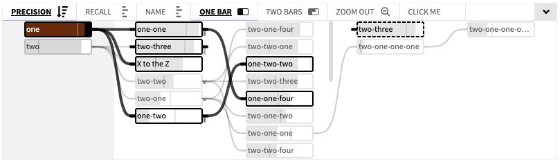

# D3 List Graph [](https://travis-ci.org/flekschas/d3-list-graph)

> A flat horizontal scrollable node-link diagram, implemented in ES6 and orchestrated by D3 **v4**.



**Demo**: https://flekschas.github.io/d3-list-graph/

**Usage**: [SATORI](http://satori.refinery-platform.org)

**Note**: Starting from version **0.17.0**, D3.js **v3.x** is no longer supported. Please use D3.js **v4.x** instead. If you need to both version please [see here](#migration-d3js-v3-to-v4).

## Install

```shell
bower install flekschas/d3-list-graph --save
```

## Dependencies

This visualization depends on the following libraries to be available globally:

- D3 **v4**
- jQuery
- jQuery's Mousewheel Plugin

## Usage

This example assumes that you're using Bower to fetch all code.

```html
<!DOCTYPE html>
<html lang="en">
<head>
  <meta charset="utf-8">
  <title>Example</title>
  <link href="bower_components/d3-list-graph/dist/listGraph.css" rel="stylesheet" type="text/css">
</head>
<body>
  <div class="list-graph">
    <div class="top-bar"></div>
    <div class="wrapper"><svg class="base"></svg></div>
  </div>
  <script src="bower_components/jquery/dist/jquery.js"></script>
  <script src="bower_components/jquery-mousewheel/jquery.mousewheel.js"></script>
  <script src="bower_components/d3/d3.js"></script>
  <script src="bower_components/d3-list-graph/dist/d3.listGraph.js"></script>
  <script src="bower_components/d3-list-graph/dist/listGraph.js"></script>
  <script>
    d3.json('bower_components/d3-list-graph/example/data.json', function (error, data) {
      if (error) throw error;

      var graph = new ListGraph({
        data: data,
        element: document.querySelector('.list-graph'),
        rootNodes: [1, 2]
      });
    });
  </script>
</body>
</html>
```

### Migration from D3.js v3 to v4

Starting from version **0.17.0**, D3.js **v3.x** is no longer supported. If you still need to run old code on D3.js v4 please stick to the following pattern to load both versions but use v4 for the tree graph.

**Note:** D3.js v4 does not actually create a new object and overwrite the global `d3` object because it embraces extensibility and modularization. Therefore, you have to load D3.js v4 **first**, reassign the variable, and then overwrite it with D3.js v3.

```html
<!DOCTYPE html>
<html lang="en">
<head>
  <meta charset="utf-8">
  <title>Example</title>
  <link href="bower_components/d3-list-graph/dist/listGraph.css" rel="stylesheet" type="text/css">
</head>
<body>
  <div class="list-graph">
    <div class="top-bar"></div>
    <div class="wrapper"><svg class="base"></svg></div>
  </div>
  <script src="bower_components/jquery/dist/jquery.js"></script>
  <script src="bower_components/jquery-mousewheel/jquery.mousewheel.js"></script>
  <script src="https://d3js.org/d3.v4.js"></script>
  <script src="bower_components/d3-list-graph/dist/d3.listGraph.js"></script>
  <script src="bower_components/d3-list-graph/dist/listGraph.js"></script>
  <script>var d3V4 = d3;</script>
  <script src="https://d3js.org/d3.v3.js"></script>
  <script>
    d3.json('bower_components/d3-list-graph/example/data.json', function (error, data) {
      if (error) throw error;

      var graph = new ListGraph({
        d3: d3V4,
        data: data,
        element: document.querySelector('.list-graph'),
        rootNodes: [1, 2]
      });
    });
  </script>
</body>
</html>
```

Make sure to load D3.js v4, the list graph layout, the list graph app, and all other version 4 related code first. Then reassign the global variable `d3` to `d3V4` (or whatever you like to call it). Finally, specify the version 4 of D3 when loading the list graph by püassing a property called `d3` and assign `d3V4` to it. When that property is unassigned the tool will use the globally available `d3` variable and complain if the version doesn't match `4.x.y`.

### Parameters

#### Required parameters:

**element**: _Object_.
DOM element that should act as the base element.

**data**: _Object_.
Unique key-value list-like object. E.g.: `{1: {...}, 2: {...}, 3: {...}}`.

**rootNodes**: _Array_.
List of node ids that should act as root nodes.

---

#### Optional parameters:

**d3**: _Object_.
D3 library. Useful when working with two different version of D3 on the same page.

**width**: _Number_ [100% of the SVG container].
Number of columns to be shown.

**height**: _Number_ [100% of the SVG container].
Number of columns to be shown.

**scrollbarWidth**: _Number_ [`6`].
Width of the scrollbars.

**columns**: _Number_ [`5`].
Number of columns to be shown.

**rows**: _Number_ [`5`].
Number of rows to be shown.

**iconPath**: _String_ [_Empty string_].
Path to an SVG icon file. Default is an empty string, which is equivalent to inline SVG, meaning that the ListGraphs internal icons are used.

**barMode**: _String_ [`one`].
Initial bar mode. Can either be `one` or `two`.

**highlightActiveLevel**: _Boolean_ [`false`].
If `true` the currently active root level is highlighted

**activeLevel**: _Number_ [`0`].
Offset of the root level to be highlighted. If `1` one level to the right of the root level will be highlighted.

**noRootActiveLevelDiff**: _Number_ [`0`].
Negative offset when no manually selected new root level is set.

**forceWidth**: _Boolean_ [`false`].
If you want to force the visualization to be of a certain width use this. [Default: false]

**sortBy**: _String_.
Initial sorting of a property. This string should be identical to the property key.

**sortOrder:** _String_ [`desc`].
Initial sort order. Can either be `asc` or `desc`.

**dispatcher**: _Function_.
Can be used to listen to internal events.

**lessTransitions**: _Number_ [`0`].
- 0 [Default]: Show all transitions
- 1: Show only CSS transitions
- 2: Show no transitions

**hideOutwardsLinks**: _Boolean_ [`false`].
If `true` links that point to invisible nodes will not be shown.

**nodeInfoContextMenu**: _Array_ [`[]`].
An array of objects specifying which node properties the _node context menu_ should be displayed. E.g. `[{ label: 'ID', property: function (data) { return data.id } }]`.

**customTopbarButtons**: _Array_ [`[]`].
An array of objects specifying custom buttons in the topbar. E.g. `[{ label: 'Click me', callback: function () { ... }, iconSvg: 'path/to/icon.svg#icon-name' }, iconSpan: 'span class names']`.

## Develop

To preview the toy development example website do:

```shell
npm start
```

In order to build a final production ready library run:

```shell
npm run build
```

**Note:** You can also pass `--production` to `gulp` in order to test if the
compiled version really works. Note that you have to change the paths in
`example/index.html`.
